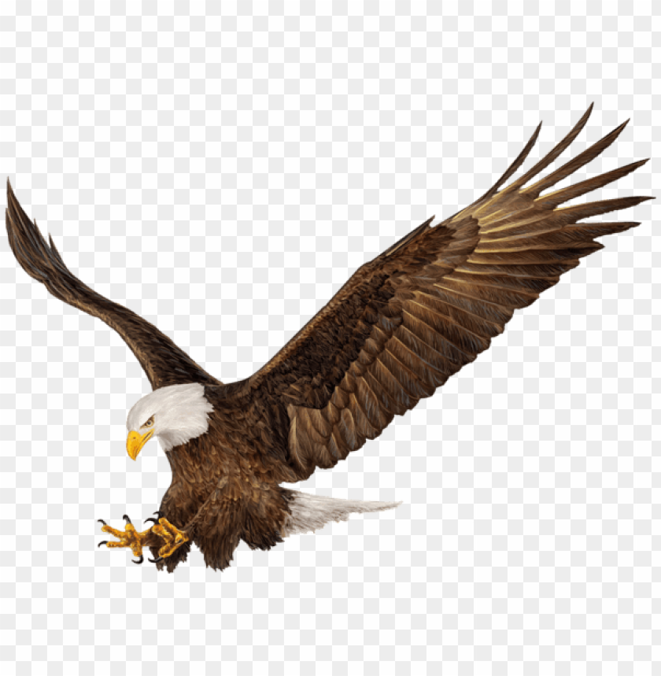

 

# ОРЕЛ /orel/

## Introduction 📋
-----

* Based on Durov API and puerkitobio package
https://github.com/cxumol/tg-channel-api?ref=golangexample.com


## Use
-----
* GET Request

```
http://localhost:8080/?channelID=informativoangelmartin&msgNum=25

https://t.me/s/killnet_reservs
```


## PUERKITOBIO

``` golang
package main

import (
  "fmt"
  "log"
  "net/http"

  "github.com/PuerkitoBio/goquery"
)

func ExampleScrape() {
  // Request the HTML page.
  res, err := http.Get("http://metalsucks.net")
  if err != nil {
    log.Fatal(err)
  }
  defer res.Body.Close()
  if res.StatusCode != 200 {
    log.Fatalf("status code error: %d %s", res.StatusCode, res.Status)
  }

  // Load the HTML document
  doc, err := goquery.NewDocumentFromReader(res.Body)
  if err != nil {
    log.Fatal(err)
  }

  // Find the review items
  doc.Find(".left-content article .post-title").Each(func(i int, s *goquery.Selection) {
		// For each item found, get the title
		title := s.Find("a").Text()
		fmt.Printf("Review %d: %s\n", i, title)
	})
}

func main() {
  ExampleScrape()
}
```

## TO DO
-----

- [ ] Add support for optional fields
  + photos `.tgme_widget_message_photo_wrap`
  + sender's name `.tgme_widget_message_from_author` 
  + etc.

- [ ] Private with API


https://github.com/gotd/td
https://github.com/LonamiWebs/Telethon

* Suscriptores
* Miembros
* Canal, grupo privado y público
* bot bajar ficheros
* Bot use el usuario para leer los mensajes


```
python3 -m venv orel

cd bin
execute activate


```